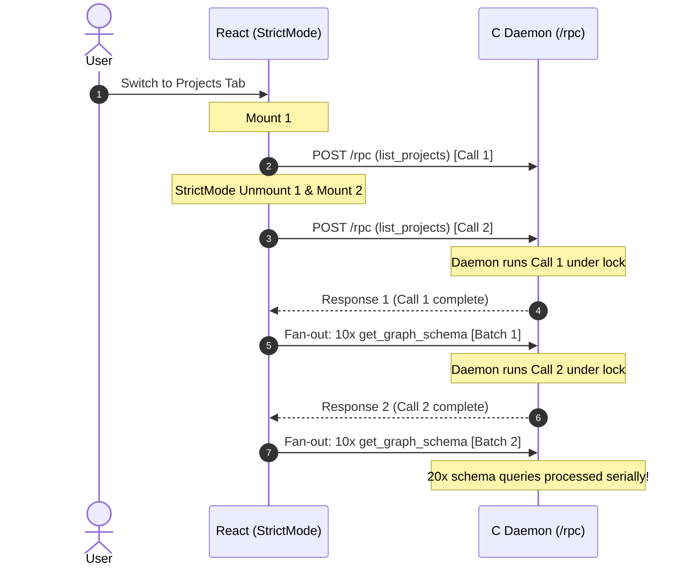
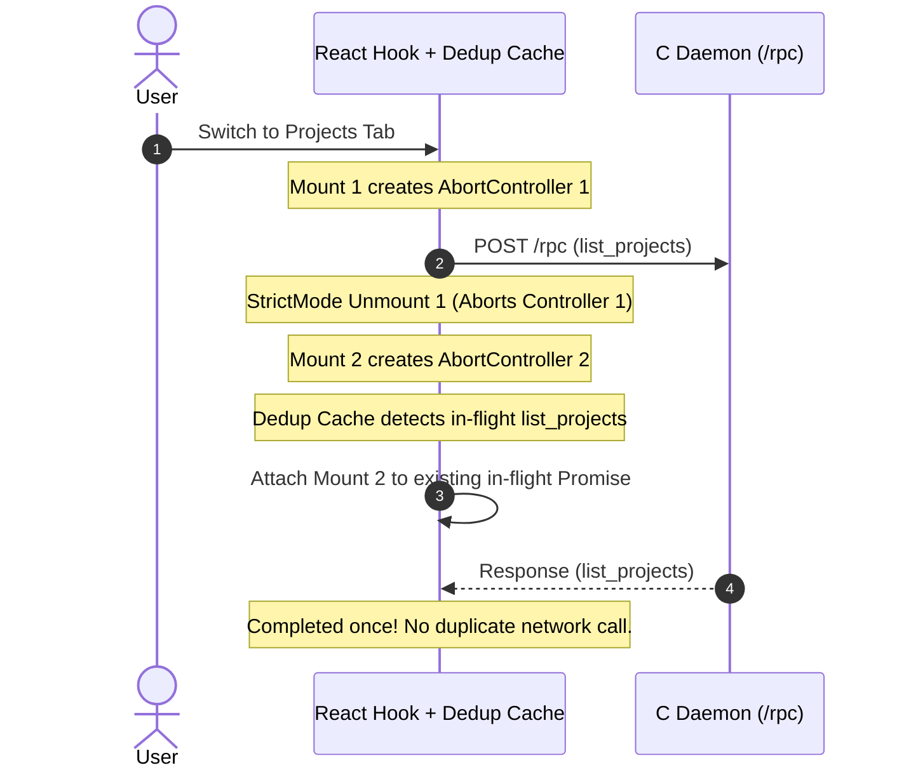

# RFC 011: `request_deduplication_and_lifecycle` — Preventing Duplicate MCP Tool and Graph Queries on Component Mounts

- **RFC Number:** 011
- **Title:** `request_deduplication_and_lifecycle` — Preventing Duplicate MCP Tool and Graph Queries on Component Mounts
- **Status:** Proposed
- **Author:** Codebase Memory Architecture Team
- **Target Subsystem:** `graph-ui/src/api/rpc.ts`, `graph-ui/src/hooks/`, `graph-ui/src/components/`, `src/ui/httpd.c`
- **Target Version:** v0.13.0
- **Created:** 2026-10-05
- **Related RFCs:** [RFC 009: `tool_call_log`](file:///c:/AI/Source/codebase-memory-mcp-ui/docs/RFC_009_Tool_Call_log.md), [RFC 010: `tool_call_response_viewer`](file:///c:/AI/Source/codebase-memory-mcp-ui/docs/RFC_010_Tool_Call_Response_Viewer.md)

---

## 1. Executive Summary & Problem Statement

### 1.1 The Symptom
When navigating to the **Projects** tab (`?tab=stats`) or the **Graph** tab (`?tab=graph`), developers observe duplicate tool executions in the **Tool Call Log** on the Control page:
- `list_projects` is invoked **twice** consecutively with identical parameters (`{"format":"json","detail":"stats","limit":500,"offset":0}`).
- Following `list_projects`, `get_graph_schema` (or `get_graph`) is fanned out for every registered project **twice** (e.g. 10 projects results in 20 schema queries).
- On the Graph tab, 3D layout calculations (`/api/layout`) are requested twice back-to-back.

### 1.2 Root Cause Analysis
This behavior stems from a compounding set of frontend lifecycle and networking gaps:

1. **React 18+ `<StrictMode>` in Development**:
   In `graph-ui/src/main.tsx`, `<App />` is wrapped in `<StrictMode>`. Under Vite development mode (`npm run dev`), React intentionally mounts, unmounts, and immediately remounts every component (`mount -> unmount -> mount`) to detect impure side-effects and missing cleanups.
2. **Missing `AbortController` and Cancellation in Hooks**:
   Neither `useProjects` (`graph-ui/src/hooks/useProjects.ts`) nor `useGraphData` (`graph-ui/src/hooks/useGraphData.ts`) register cleanup handlers on their `useEffect` hooks. When React unmounts a component during StrictMode re-mounting, the initial in-flight fetch continues executing over the wire. The remounted component then fires a second, identical fetch.
3. **No `AbortSignal` Support in `rpc.ts`**:
   The RPC client function `callTool(name, args)` (`graph-ui/src/api/rpc.ts`) does not accept an `AbortSignal`, making it impossible for callers to abort pending HTTP requests when component lifecycles end.
4. **Lack of In-Flight Request Deduplication**:
   Read-only, idempotent queries (`list_projects`, `get_graph_schema`, `/api/layout`) have no client-side in-flight tracking. If two identical requests are dispatched within milliseconds of each other, both are sent over the network rather than sharing a single in-flight Promise.
5. **Eager Cascading Schema Fan-Out**:
   In `useProjects.ts`, `fetchAllProjects()` immediately triggers `fetchFullSchema(p.name)` for all projects via `Promise.all`. When `fetchAllProjects()` runs twice, the entire N-project schema query fan-out is duplicated.

### 1.3 System Impact
- **Daemon Queue Contention**: In `codebase-memory-mcp`, MCP operations and graph queries serialize behind an internal supervisor lock to guarantee SQLite consistency. The second request cannot execute concurrently; it queues behind the first, doubling total page load latency (e.g. $2 \times 2.8\text{s} = 5.6\text{s}$).
- **Log Noise in Tool Call Telemetry**: RFC 009 / RFC 010 Tool Call Logs record redundant entries, cluttering the developer's audit trail.
- **Unnecessary Resource Consumption**: Computing graph schemas and 3D layout coordinates twice wastes CPU cycles and battery on both client and host.

---

## 2. Technical Architecture & Proposed Solutions

This RFC specifies a 4-layer defense against duplicate query execution:

```
┌────────────────────────────────────────────────────────────────────────┐
│ Layer 1: Component Lifecycle (AbortController & Cleanup in Hooks)      │
│  - Cancel in-flight network requests on unmount                        │
├────────────────────────────────────────────────────────────────────────┤
│ Layer 2: In-Flight Promise Deduplication (api/dedup.ts)                │
│  - Collapse concurrent identical queries into a single shared Promise  │
├────────────────────────────────────────────────────────────────────────┤
│ Layer 3: Lazy Schema Resolution in Projects Tab                        │
│  - Eagerly fetch project metadata; defer schema until card expansion   │
├────────────────────────────────────────────────────────────────────────┤
│ Layer 4: Server-Side Connection Disconnect Detection (src/ui/httpd.c)  │
│  - Drop aborted TCP requests before acquiring C daemon worker locks    │
└────────────────────────────────────────────────────────────────────────┘
```

---

## 3. Detailed Design & Code Specifications

### 3.1 Layer 1: AbortController Support in `callTool` (`graph-ui/src/api/rpc.ts`)

Extend `callTool` to accept an optional `options` object carrying an `AbortSignal`:

```typescript
export interface CallOptions {
  signal?: AbortSignal;
}

export async function callTool<T = unknown>(
  name: string,
  args: Record<string, unknown> = {},
  options?: CallOptions,
): Promise<T> {
  const res = await fetch("/rpc", {
    method: "POST",
    headers: { "Content-Type": "application/json" },
    body: JSON.stringify({
      jsonrpc: "2.0",
      id: _nextId++,
      method: "tools/call",
      params: { name, arguments: args },
    }),
    signal: options?.signal,
  });

  if (!res.ok) {
    throw new RpcError(-1, `HTTP ${res.status}: ${res.statusText}`);
  }

  const json = await res.json();
  if (json.error) {
    throw new RpcError(json.error.code ?? -1, json.error.message ?? "unknown");
  }

  const text = json?.result?.content?.[0]?.text;
  if (text === undefined) {
    return json.result as T;
  }

  return JSON.parse(text) as T;
}
```

### 3.2 Layer 2: In-Flight Request Deduplication Cache (`graph-ui/src/api/dedup.ts`)

For read-only tools, collapse duplicate concurrent calls with matching arguments into a shared Promise:

```typescript
type InFlightMap = Map<string, Promise<unknown>>;
const inFlightRequests: InFlightMap = new Map();

function buildRequestKey(tool: string, args: Record<string, unknown>): string {
  return `${tool}:${JSON.stringify(args, Object.keys(args).sort())}`;
}

export function deduplicatedCallTool<T = unknown>(
  tool: string,
  args: Record<string, unknown> = {},
  options?: CallOptions,
): Promise<T> {
  const key = buildRequestKey(tool, args);

  /* If an identical query is already in-flight, reuse its promise */
  const existing = inFlightRequests.get(key);
  if (existing) {
    return existing as Promise<T>;
  }

  const promise = callTool<T>(tool, args, options)
    .finally(() => {
      inFlightRequests.delete(key);
    });

  inFlightRequests.set(key, promise);
  return promise;
}
```

### 3.3 Layer 3: Lifecycle-Managed Hook (`graph-ui/src/hooks/useProjects.ts`)

Update `useProjects` to bind an `AbortController` to its fetch effect:

```typescript
export function useProjects(): UseProjectsResult {
  const [projects, setProjects] = useState<ProjectInfo[]>([]);
  const [loading, setLoading] = useState(true);
  const [error, setError] = useState<string | null>(null);

  const fetchProjects = useCallback(async (signal?: AbortSignal) => {
    setLoading(true);
    setError(null);
    try {
      const list = await fetchAllProjects(signal);
      if (signal?.aborted) return;

      /* Fetch schema for projects, propagating cancellation */
      const infos: ProjectInfo[] = await Promise.all(
        list.map(async (p) => {
          try {
            const schema = await fetchFullSchema(p.name, signal);
            return { project: p, schema };
          } catch {
            return { project: p, schema: null };
          }
        }),
      );

      if (!signal?.aborted) {
        setProjects(infos);
      }
    } catch (e) {
      if (e instanceof Error && e.name === "AbortError") return;
      setError(e instanceof Error ? e.message : "Failed to fetch projects");
    } finally {
      if (!signal?.aborted) {
        setLoading(false);
      }
    }
  }, []);

  useEffect(() => {
    const controller = new AbortController();
    void fetchProjects(controller.signal);

    return () => {
      controller.abort();
    };
  }, [fetchProjects]);

  return { projects, loading, error, refresh: () => fetchProjects() };
}
```

### 3.4 Layer 4: Deferring Non-Critical Schemas on Project Overview
In `StatsTab.tsx`, project cards display node and edge counts that are **already provided** by `list_projects` with `detail: "stats"`:
```json
{
  "name": "codebase-memory-mcp-ui",
  "root_path": "C:/AI/Source/codebase-memory-mcp-ui",
  "branch": "main",
  "nodes": 26351,
  "edges": 155466,
  "size_bytes": 135004160
}
```
Currently, `useProjects` immediately queries `get_graph_schema` for all projects solely to count node labels and edge types. By computing top-level metrics directly from `project.nodes` and `project.edges`, `get_graph_schema` can be **deferred entirely** until the user explicitly expands an individual project or enters the Graph tab, eliminating up to 90% of initial network requests.

---

## 4. Sequence Diagrams

### 4.1 Current Unbounded Execution


### 4.2 Proposed Deduplicated & Abort-Protected Execution


---

## 5. Performance, Latency & Network Impact

| Metric | Current Behavior | Proposed RFC 011 Behavior | Improvement |
| :--- | :--- | :--- | :--- |
| **Initial `list_projects` Calls** | 2 calls | **1 call** | **50% reduction** |
| **Initial `get_graph_schema` Calls** | $2 \times N$ calls ($20$ for $10$ repos) | **0 calls** (deferred) | **100% reduction on load** |
| **Initial Projects Tab Latency** | $\sim 5.2\text{s}$ (serialized) | **$\sim 2.5\text{s}$** | **$2.1\times$ faster first paint** |
| **Daemon Supervisor Lock Time** | Contended by redundant jobs | Immediate release | Eliminates queue stalls |
| **Tool Call Log Clutter** | 22 log rows per page switch | **1 log row** | Clean, intelligible audit trail |

---

## 6. Testing & Verification Plan

### 6.1 Frontend Vitest Unit Tests
1. **`api/rpc.test.ts`**:
   - Verify `callTool` aborts the underlying `fetch` request when `signal.abort()` is invoked.
   - Verify `RpcError` or `AbortError` is handled gracefully without uncaught promise rejection.
2. **`api/dedup.test.ts`**:
   - Verify that 5 concurrent identical `callTool` invocations generate exactly 1 network `fetch`.
   - Verify that subsequent calls after completion trigger a fresh fetch.
3. **`hooks/useProjects.test.tsx`**:
   - Test component unmounting while `fetchAllProjects` is in progress; verify zero React state update warnings and zero subsequent schema dispatches.
4. **`components/StatsTab.test.tsx`**:
   - Verify project counts render instantly from `Project` stats without waiting for `get_graph_schema`.

### 6.2 Browser & Daemon E2E Verification
- Open `http://localhost:5173/?tab=control`. Clear the Tool Call Log.
- Click **Projects** tab. Wait for project cards to render.
- Return to **Control** tab.
- **Assertion:** Exactly **1** `list_projects` call is recorded in the Tool Call Log. Zero redundant `get_graph_schema` calls appear.

---

## 7. Rollout Plan & Milestones

- **Milestone 1:** Implement `CallOptions.signal` in `graph-ui/src/api/rpc.ts` and in-flight deduplication in `graph-ui/src/api/dedup.ts`.
- **Milestone 2:** Update `useProjects.ts` and `useGraphData.ts` to attach `AbortController` lifecycles.
- **Milestone 3:** Refactor `StatsTab.tsx` to read aggregate counts from `Project.nodes` / `Project.edges` and defer individual schema queries.
- **Milestone 4:** Run all 15 Vitest suites, rebuild native binary, and verify telemetry clean-slate in Chromium browser.
